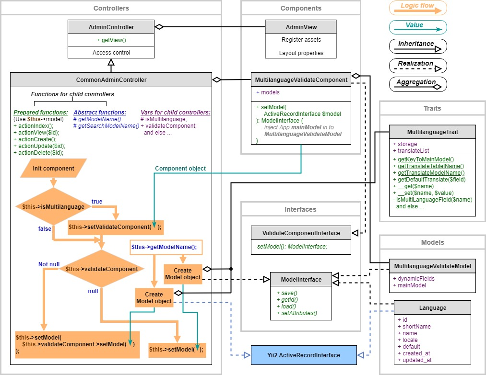

Yii2 Admin module
==============

[](https://packagist.org/packages/itstructure/yii2-admin-module)
[](https://packagist.org/packages/itstructure/yii2-admin-module)
[](https://packagist.org/packages/itstructure/yii2-admin-module)
[](https://packagist.org/packages/itstructure/yii2-admin-module)
[](https://scrutinizer-ci.com/g/itstructure/yii2-admin-module/build-status/master)
[](https://scrutinizer-ci.com/g/itstructure/yii2-admin-module/?branch=master)

1 Introduction
----------------------------

**Yii2AdminModule** -- Module for the Yii2 framework with [AdminLTE](https://github.com/almasaeed2010/AdminLTE) template, which provides the following options:
- Use this module as base administrator dashboard to manage site content with the ability to extend it by children application CRUD's
- Work in multilanguage mode for content
- Work in multilanguage mode for dashboard

Module functional block scheme:



Note!!!

As this module gives you a freedom in the architecture of your application child classes, pay attention:
- There are no the next specific entity model classes, which are as examples in documentation: ```Catalog```, ```CatalogLanguage``` - you have to create them personally in your application.
- There are no the next specific controller class, which is as example in documentation: ```CatalogController``` - you have to create it personally in your application.
- There are not routes - you have to create that according with your application controller map.

Base project example, which uses this admin module for multilanguage content and dashboard: [yii2-template-multilanguage](https://github.com/itstructure/yii2-template-multilanguage).

Base project example, which uses this admin module for simple data: [yii2-template-simple](https://github.com/itstructure/yii2-template-simple).

Addition module description you can see in my [Personal site](https://pack-develop.info/en/product/yii2-admin-module).

2 Dependencies
----------------------------

- php >= 7.1
- composer

3 Installation
----------------------------

Via composer:

```composer require itstructure/yii2-admin-module ~1.8.0```

or in section **require** of composer.json file set the following:
```
"require": {
    "itstructure/yii2-admin-module": "~1.8.0"
}
```
and command ```composer install```, if you install yii2 project extensions first,

or command ```composer update```, if all yii2 project extensions are already installed.

4 Usage
----------------------------

### 4.1 Main properties

The **name** of module: ```admin```

The **namespace** for used classes: ```Itstructure\AdminModule```.

The **alias** to access in to module root directory: ```@admin```.

The main module template **layout** is in: ```@admin/views/layouts/main-admin.php```.

### 4.2 Application config

Base application config must be like in example below:

```php
use Itstructure\AdminModule\Module;
use Itstructure\AdminModule\components\AdminView;
```

```php
'modules' => [
    'admin' => [
        'class' => Module::class,
        'viewPath' => '@app/views/admin',
        'controllerMap' => [
            'catalog' => CatalogController::class,
        ],
        'accessRoles' => ['admin', 'manager'],
        'components' => [
            'view' => [
                'class' => AdminView::class,
                'skin' => AdminView::SKIN_GREEN_LIGHT,
                'bodyLayout' => AdminView::LAYOUT_SIDEBAR_MINI,
                'mainMenuConfig' => require __DIR__ . '/main-menu.php'
                'extraAssets' => require __DIR__ . '/extra-assets.php',
            ],
        ],
    ],
],
```
Here,

```viewPath``` - view template location for CRUDs, which you will create in application.

```CatalogController``` - example controller.

```accessRoles``` - an array of roles, that are allowed to access. Bu default ['@'].

in ```components``` the ```view``` component contains required parameter ```class```.
Such parameters as ```skin```, ```bodyLayout``` - dashboard style, can be set custom.

Parameter ```mainMenuConfig``` - is the sidebar admin menu, which must be an array:
```php
[
    'menuItems' => [
        'catalog' => [
            'title' => 'Catalog',
            'icon' => 'fa fa-database',
            'url' => '#',
            'subItems' => [
                'subitem' => [
                    'title' => 'Subcatalog',
                    'icon' => 'fa fa-link',
                    'url' => '/admin/catalog',
                ]
            ]
        ],
        'otheritem' => [
            'title' => 'Other Item',
            'icon' => 'fa fa-database',
            'url' => '/admin/otheritem',
        ],
    ],
]
```

Parameter ```extraAssets``` - extra assets, can be like in examples:

- Like a class names

    ```php
    [
        FirstExtraAsset::class,
        SecondExtraAsset::class,
    ]
    ```

- Or like an array config

    ```php
    [
        [
            'class' => FirstExtraAsset::class,
        ],
        [
            'class' => SecondExtraAsset::class,
        ],
    ]
    ```

### 4.3 Base controllers

In **Yii2AdminModule** there are two controllers, which can be used by child application 
controllers:

- ```AdminController```

    When using this controller, a class AdminView will be loaded with its assets. This is done 
    using getView() method, which in turn is taken from **module** class with getting the 
    **view** component. 

- ```CommonAdminController```

    This controller extends ```AdminController```.
    There are already created universal basic methods for child application controllers:
    - actionIndex();
    - actionView($id);
    - actionCreate();
    - actionUpdate($id);
    - actionDelete($id);
    
    In order for the child application controller to work with the CommonAdminController, it is 
    necessary to define the functions in child controller:
    - getModelName(); Sets the name of main model class.
    - getSearchModelName(); - Sets the name of main search model class.
    
    In CommonAdminController there are the next interesting options:
    - ```viewCreated``` - to view the record after it's creation instead all record list.
    - ```additionFields``` - array of addition fields with heir values for the view template.
    - ```additionAttributes``` - array of addition attributes with their values for current 
    model, which can be set in model except for those that are sent from the form.
    Example: information about the uploaded file, which was uploaded separate from the main send from the form.

### 4.4 Integrated controllers

In **Yii2AdminModule** there is one integrated controller:

- ```LanguageController``` - to manage just languages for application data.

### 4.5 Multilanguage mode for dashboard tools

Multilanguage mode just for dashboard you can set by ```language``` parameter in app configuration: ```en-US```, ```ru-RU``` e.t.c.

### 4.6 Multilanguage mode for data

There is an opportunity to set modes by application configuration, using parameter:

- ```isMultilanguage``` - work in multilanguage mode just for content.

    When **true**, the sidebar link "Languages" in main menu will appear automatically.

And application configuration will take an appearance:

```php
use Itstructure\AdminModule\Module;
use Itstructure\AdminModule\components\AdminView;
```

```php
'modules' => [
    'admin' => [
        'class' => Module::class,
        'viewPath' => '@app/views/admin',
        'controllerMap' => [
            'catalog' => CatalogController::class,
        ],
        ...
        ...
        'isMultilanguage' => true,
    ],
],
```

In multilanguage mode, such a standard is adopted:

1.  All multilanguage fields will be with a language postfix:

    **title_en**
    
    **description_en**, e t. c.
    
2. Single and multilanguage fields will be rendered in view template by spectial fields widget.

3. All fields values after form sending will be loaded to the 
**MultilanguageValidateModel** by **MultilanguageValidateComponent** in **CommonAdminController**.

4. Then **MultilanguageValidateModel** will load validated values in to the main model.

5. In **main model** the field values will be processed by **MultilanguageTrait** to separate 
their between own **main model** and **translate model**.

6. As a model in view template, it will the **MultilanguageValidateModel**, that is set by 
**MultilanguageValidateComponent** in **CommonAdminController**.

7. Rules configuration for multilanguage fields validation need to be set in individual component 
config.

8. Rules configuration for single fields validation need to be set in the main model.

9. All the above configurations will be combined in **MultilanguageValidateModel** for general 
process.

**To use this mode it's necessary:**

1. Set module parameter ```isMultilanguage``` on **true** in application config section **mdules**
 -> **admin**.

2. Apply module migration: ```migrations/multilanguage/m171202_104405_create_language_table```

    For that make next, **if not already done**:
    
    - Define **admin module** in application **console** config file:
    
        ```php
        use Itstructure\AdminModule\Module;
        ```
        ```php
        'modules' => [
            'admin' => [
                'class' => Module::class,
            ],
        ],
        ```
    
    - In file **yii**, that is located in application root directory, set **@admin** alias:
    
        ```php
        $application = new yii\console\Application($config);
        
        \Yii::setAlias('@admin', $application->getModule('admin')->getBasePath());
        
        $exitCode = $application->run();
        ```
        
        OR
        
        ```php
        use Itstructure\AdminModule\Module;
        ```
        
        ```php
        $application = new yii\console\Application($config);
        
        \Yii::setAlias('@admin', Module::getBaseDir());
        
        $exitCode = $application->run();
        ```
        
    - Run command in console:
    
        ```
        yii migrate --migrationPath=@admin/migrations/multilanguage
        ```
        
    - Check if the sidebar link to manage languages is appeared.
    
3. Application migrations must be extended from 
```Itstructure\AdminModule\components\MultilanguageMigration```

    It's necessary to automatically creation main table and translate table.

4. Data base tables will have a structure, like in example:

    ```Main table "catalog"```
    
    ```php
        | id | order |      created_at     |      updated_at     |
        |----|-------|---------------------|---------------------|
        | 1  |   2   | 2018-01-14 18:06:33 | 2018-01-14 18:06:33 |
        | 2  |   1   | 2018-01-14 18:10:00 | 2018-01-14 18:10:00 |
        | 3  |   3   | 2018-01-14 19:05:15 | 2018-01-14 19:05:15 |
    ```

    ```Translate table "catalog_language"```

    ```php
        | catalog_id | language_id |   title   |      description     |      created_at     |      updated_at     |
        |------------|-------------|-----------|----------------------|---------------------|---------------------|
        |      1     |      1      | Catalog 1 |     Description 1    | 2018-01-14 18:06:33 | 2018-01-14 18:06:33 |
        |      1     |      2      | Каталог 1 |     Описание 1       | 2018-01-14 18:06:33 | 2018-01-14 18:06:33 |
        |      2     |      1      | Catalog 2 |     Description 2    | 2018-01-14 18:10:00 | 2018-01-14 18:10:00 |
        |      3     |      1      | Catalog 3 |     Description 3    | 2018-01-14 19:05:15 | 2018-01-14 19:05:15 |
        |      3     |      2      | Каталог 3 |     Описание 3       | 2018-01-14 19:05:15 | 2018-01-14 19:05:15 |
    ```

    ```Language table "language"```

    ```php
        | id | locale | shortName |  name   | default |      created_at     |      updated_at     |
        |----|--------|-----------|---------|---------|---------------------|---------------------|
        | 1  | en-US  |    en     | English |    1    | 2018-01-14 18:06:33 | 2018-01-14 18:06:33 |
        | 2  | ru-RU  |    ru     | Русский |    0    | 2018-01-14 18:10:00 | 2018-01-14 18:10:00 |
    ```

    Here,
    
    Not multilanguage fields: **id**, **order**.
    
    Multilanguage fields: **title**, **description**.

5. For all described tables above, it is necessary to create CRUD model classes, like in exemple:

    **Catalog** - main model
    
    **CatalogLanguage** - translate model
    
    **Language** - **already exists in module!**

6. In child application admin controller define function getModelName(), like in example:

    ```php
    protected function getModelName():string
    {
        return Catalog::class;
    }
    ```

7. In child application admin controller define function getSearchModelName(), like in example:

    ```php
    protected function getSearchModelName():string
    {
        return CatalogSearch::class;
    }
    ```

8. In main model, use trait, like in example:

    ```php
    use Itstructure\AdminModule\models\MultilanguageTrait;
    
    class Catalog extends ActiveRecord
    {
        use MultilanguageTrait;
    ...
    ```
    
    Using this trait, the multilanguage fields values, that are set like for example 
    **title_en**, **description_en**, will be redirected to the translate model automatically.
    
    Not multilanguage fields, such as **order** e. t. c., will be set in to the main model 
    automatically.

9. To display form fields in view templates use special widget (installed by composer.json dependency):

    ```php
    use Itstructure\FieldWidgets\Fields.php;
    ```
    
    like in example:
    
    ```php
    $form = ActiveForm::begin();
    ```
    
    ```php
    echo Fields::widget([
        'fields' => [
            [
                'name' => 'title',
                'type' => FieldType::FIELD_TYPE_TEXT,
            ],
            [
                'name' => 'description',
                'type' => FieldType::FIELD_TYPE_TEXT_AREA,
            ],
        ],
        'model'         => $model,
        'form'          => $form,
        'languageModel' => new Language()
    ])
    ```
    
    ```php
    Html::submitButton($model->isNewRecord ? 'Create' : 'Update', ['class' => $model->isNewRecord ? 'btn btn-success' : 'btn btn-primary'])
    ```
    
    ```php
    ActiveForm::end();
    ```
    
    Here,
    
    - **Language** - is a class in ```Itstructure\AdminModule\models\Language.php```
    
    - This widget (when for example two languages **ru** and **en**) will parse the form fields so:
    
        title_en
        
        title_ru
        
        description_en
        
        description_ru
    
    - if do not set the attribute **languageModel**, form fields will not be multilanguage and 
    will be single.
    
    - **$model** - will be set automatically in **CommonAdminController** as object of 
    ```Itstructure\AdminModule\models\MultilanguageValidateModel```, in which the main model can 
    be set after define her class name by method **getModelName()**.

10. Configure the multilanguage component ```multilanguage-validate-component``` for **admin** module with rules for validation 
multilanguage data in application config, like in example:

    ```php
    use Itstructure\AdminModule\Module;
    use Itstructure\AdminModule\components\AdminView;
    use Itstructure\AdminModule\components\MultilanguageValidateComponent;
    ```

    ```php
    'modules' => [
        'admin' => [
            'class' => Module::class,
            'viewPath' => '@app/views/admin',
            'controllerMap' => [
                'catalog' => CatalogController::class,
                ...
            ],
            'isMultilanguage' => true,
            'components' => [
                'view' => [
                    'class' => AdminView::class,
                    'skin' => AdminView::SKIN_GREEN_LIGHT,
                    'bodyLayout' => AdminView::LAYOUT_SIDEBAR_MINI,
                    'mainMenuConfig' => require __DIR__ . '/main-menu.php'
                ],
                'multilanguage-validate-component' => [
            
                    /**
                     * Component class.
                     */
                    'class' => MultilanguageValidateComponent::class,
            
                    /**
                     * List of models.
                     * Each model is identified by the name of the table.
                     * In the config attributes of each model, you need to specify:
                     * Dynamic (translated fields) dynamicFields.
                     * Field dynamicFields needs to have: 'name' - field name.
                     * Field dynamicFields (not necessary) may have 'rules'.
                     */
                    'models' => [
                        Catalog::tableName() => [
                            'dynamicFields' => [
                                [
                                    'name' => 'title',
                                    'rules' => [
                                        [
                                            'required',
                                            'message' => 'Field "{attribute}" must not be empty.'
                                        ],
                                        [
                                            'string',
                                            'max' => 255,
                                        ],
                                        [
                                            'unique',
                                        ]
                                    ]
                                ],
                                [
                                    'name' => 'description',
                                    'rules' => [
                                        [
                                            'required',
                                            'message' => 'Field "{attribute}" must not be empty.'
                                        ],
                                        [
                                            'string',
                                        ]
                                    ]
                                ],
                            ],
                        ]
                    ]
                ]
            ],
        ]
    ]
    ```

**Useful feature:**

After release 1.6.2 in ```MultilanguageValidateModel``` class the **mainModelAttributes()** method checking is added to check its presence in main model.
This may be necessary when you need to validate fields that are not in the database table. These fields can be set in this method, in addition to the main fields. The method must return an array.

License
----------------------------

Copyright © 2018-2020 Andrey Girnik girnikandrey@gmail.com.

Licensed under the [MIT license](http://opensource.org/licenses/MIT). See LICENSE.txt for details.
